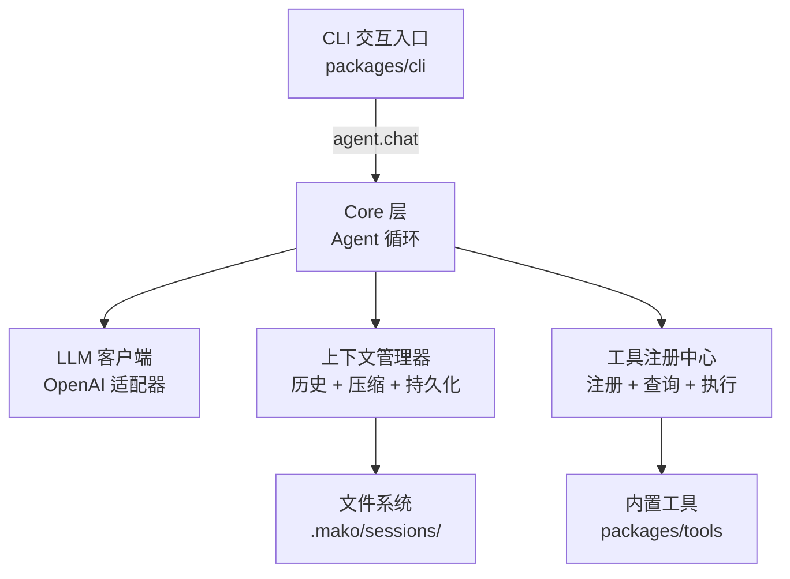
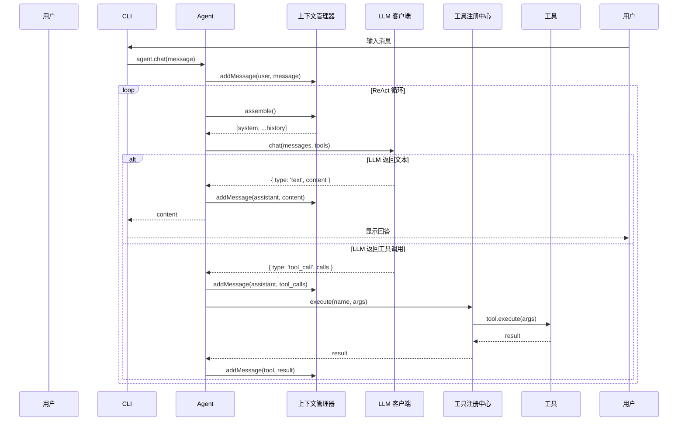

# 设计文档

## 概述

Mako v0.1 核心目标：**跑通一个完整的 Agent 循环**。用户通过 CLI 输入自然语言指令，Agent 通过 ReAct 模式调用 LLM 和工具，最终返回结果。

### 设计原则

1. **简单直接**：Core 直接调用内置模块，无调度器/事件总线
2. **接口分离**：LLM 客户端通过接口定义，实现可替换
3. **职责清晰**：上下文管理器封装所有上下文复杂度，Agent 循环只关心循环逻辑
4. **配置驱动**：切换模型只需改配置文件

### 项目结构

```
mako/
├── packages/
│   ├── core/                    ← Agent 核心（调度 + 循环 + 内置模块）
│   │   ├── src/
│   │   │   ├── index.ts             # 公共 API 导出
│   │   │   ├── agent.ts             # Agent 主循环（ReAct）
│   │   │   ├── llm/
│   │   │   │   ├── types.ts         # LLMAdapter 接口定义
│   │   │   │   └── openai-adapter.ts # OpenAI 兼容实现
│   │   │   ├── context/
│   │   │   │   ├── context-manager.ts # 上下文管理器
│   │   │   │   └── token-counter.ts   # Token 计数
│   │   │   ├── tools/
│   │   │   │   └── tool-registry.ts   # 工具注册中心
│   │   │   └── types.ts             # 公共类型定义
│   │   ├── __tests__/
│   │   │   ├── agent.test.ts
│   │   │   ├── context-manager.test.ts
│   │   │   └── tool-registry.test.ts
│   │   ├── package.json
│   │   └── tsconfig.json
│   ├── tools/                   ← 内置工具
│   │   ├── src/
│   │   │   ├── index.ts             # 导出所有工具
│   │   │   ├── read-file.ts
│   │   │   ├── write-file.ts
│   │   │   ├── replace-in-file.ts
│   │   │   ├── list-directory.ts
│   │   │   ├── bash.ts
│   │   │   ├── search.ts
│   │   │   └── fetch-url.ts
│   │   ├── __tests__/
│   │   │   ├── read-file.test.ts
│   │   │   ├── write-file.test.ts
│   │   │   ├── bash.test.ts
│   │   │   └── search.test.ts
│   │   ├── package.json
│   │   └── tsconfig.json
│   └── cli/                     ← CLI 交互入口
│       ├── src/
│       │   ├── index.ts             # 入口 + readline 循环
│       │   └── config.ts            # 配置加载
│       ├── package.json
│       └── tsconfig.json
├── pnpm-workspace.yaml
├── tsconfig.base.json
├── package.json
└── vitest.config.ts
```

---

## 架构

### 分层架构



### 数据流：一次完整交互



### 模块依赖关系

```
packages/cli → packages/core → (无外部包依赖)
packages/cli → packages/tools
packages/tools → (node:fs, node:child_process)
packages/core → openai (npm)
```

- `packages/core` 对 `packages/cli` 零依赖
- `packages/core` 对 `packages/tools` 零依赖（工具通过 registry 注入）
- CLI 负责创建 Agent 实例、注册工具、启动交互

---

## 组件与接口

### 1. 公共类型定义（`packages/core/src/types.ts`）

```typescript
/** 消息角色 */
export type MessageRole = 'system' | 'user' | 'assistant' | 'tool';

/** 工具调用 */
export interface ToolCall {
  id: string;
  name: string;
  arguments: Record<string, unknown>;
}

/** 对话消息 */
export interface Message {
  role: MessageRole;
  content: string | null;
  toolCalls?: ToolCall[];
  toolCallId?: string;  // tool 角色消息需要
}

/** LLM 响应 */
export type LLMResponse =
  | { type: 'text'; content: string }
  | { type: 'tool_calls'; toolCalls: ToolCall[] };

/** LLM 流式响应块 */
export interface LLMStreamChunk {
  type: 'text_delta' | 'tool_call_delta' | 'done';
  content?: string;
  toolCall?: Partial<ToolCall>;
}

/** 工具定义 */
export interface Tool {
  name: string;
  description: string;
  parameters: Record<string, unknown>;  // JSON Schema
  execute(args: Record<string, unknown>): Promise<string>;
}

/** OpenAI function calling 格式 */
export interface ToolDefinitionForLLM {
  type: 'function';
  function: {
    name: string;
    description: string;
    parameters: Record<string, unknown>;
  };
}

/** Agent 配置 */
export interface AgentConfig {
  llm: LLMConfig;
  maxIterations: number;       // 默认 20
  systemPrompt: string;
  contextConfig: ContextConfig;
}

/** LLM 配置 */
export interface LLMConfig {
  baseUrl: string;
  apiKey: string;
  model: string;
}

/** 上下文配置 */
export interface ContextConfig {
  maxTokens: number;           // 上下文窗口大小
  compressThreshold: number;   // 触发压缩的 token 阈值（如 maxTokens * 0.8）
  sessionDir: string;          // 默认 '.mako/sessions'
}
```

### 2. LLM 适配器接口（`packages/core/src/llm/types.ts`）

```typescript
import type { Message, LLMResponse, LLMStreamChunk, ToolDefinitionForLLM } from '../types.js';

/** 聊天选项 */
export interface ChatOptions {
  tools?: ToolDefinitionForLLM[];
  temperature?: number;
  maxTokens?: number;
}

/** LLM 适配器接口 */
export interface LLMAdapter {
  /** 发送消息，返回完整响应 */
  chat(messages: Message[], options?: ChatOptions): Promise<LLMResponse>;

  /** 发送消息，返回流式响应 */
  stream(messages: Message[], options?: ChatOptions): AsyncIterable<LLMStreamChunk>;
}

/** LLM 错误 */
export class LLMError extends Error {
  constructor(
    message: string,
    public readonly statusCode?: number,
    public readonly rawError?: unknown,
  ) {
    super(message);
    this.name = 'LLMError';
  }
}
```

### 3. OpenAI 适配器实现（`packages/core/src/llm/openai-adapter.ts`）

```typescript
import OpenAI from 'openai';
import type { LLMAdapter, ChatOptions } from './types.js';
import type { Message, LLMResponse, LLMStreamChunk, LLMConfig } from '../types.js';

export class OpenAIAdapter implements LLMAdapter {
  private client: OpenAI;
  private model: string;

  constructor(config: LLMConfig) {
    this.client = new OpenAI({
      baseURL: config.baseUrl,
      apiKey: config.apiKey,
    });
    this.model = config.model;
  }

  async chat(messages: Message[], options?: ChatOptions): Promise<LLMResponse> {
    // 将内部 Message 格式转换为 OpenAI SDK 格式
    // 调用 client.chat.completions.create
    // 解析响应为 LLMResponse
  }

  async *stream(messages: Message[], options?: ChatOptions): AsyncIterable<LLMStreamChunk> {
    // 调用 client.chat.completions.create({ stream: true })
    // 逐块 yield LLMStreamChunk
  }
}
```

### 4. 上下文管理器（`packages/core/src/context/context-manager.ts`）

```typescript
import type { Message, ContextConfig } from '../types.js';
import type { LLMAdapter } from '../llm/types.js';

export class ContextManager {
  private messages: Message[] = [];
  private systemPrompt: string;
  private config: ContextConfig;
  private llm: LLMAdapter;  // 用于摘要压缩

  constructor(systemPrompt: string, config: ContextConfig, llm: LLMAdapter) {
    this.systemPrompt = systemPrompt;
    this.config = config;
    this.llm = llm;
  }

  /** 添加消息 */
  addMessage(message: Message): void;

  /** 获取对话历史（不含 system prompt） */
  getMessages(): Message[];

  /** 组装完整消息序列：system prompt + 对话历史 */
  assemble(): Message[];

  /** 清空对话历史 */
  clear(): void;

  /** 获取当前 token 数量估算 */
  getTokenCount(): number;

  /** 检查并执行压缩（超阈值时自动摘要早期消息） */
  async compressIfNeeded(): Promise<void>;

  /** 持久化到磁盘 */
  async save(sessionId: string): Promise<void>;

  /** 从磁盘加载 */
  async load(sessionId: string): Promise<void>;
}
```

**压缩策略**：
- 当 `getTokenCount() > config.compressThreshold` 时触发
- 保留最近 N 条消息不动（N 由剩余 token 空间决定）
- 对早期消息调用 LLM 生成摘要，替换为一条 system 角色的摘要消息
- 摘要 prompt：`"请将以下对话历史压缩为简洁摘要，保留关键信息和决策："`

### 5. 工具注册中心（`packages/core/src/tools/tool-registry.ts`）

```typescript
import type { Tool, ToolDefinitionForLLM, ToolCall } from '../types.js';

export class ToolRegistry {
  private tools: Map<string, Tool> = new Map();

  /** 注册工具，名称冲突时抛出错误 */
  register(tool: Tool): void;

  /** 根据名称获取工具 */
  get(name: string): Tool | undefined;

  /** 返回所有已注册工具 */
  list(): Tool[];

  /** 返回 OpenAI function calling 格式的工具描述 */
  listForLLM(): ToolDefinitionForLLM[];

  /** 执行工具调用 */
  async execute(toolCall: ToolCall): Promise<string>;
}
```

### 6. Agent（`packages/core/src/agent.ts`）

```typescript
import type { AgentConfig, Message } from './types.js';
import { ContextManager } from './context/context-manager.js';
import { ToolRegistry } from './tools/tool-registry.js';
import type { LLMAdapter } from './llm/types.js';

export interface AgentResponse {
  content: string;
  iterations: number;
}

export class Agent {
  private llm: LLMAdapter;
  private context: ContextManager;
  private toolRegistry: ToolRegistry;
  private maxIterations: number;

  constructor(config: AgentConfig, llm: LLMAdapter, toolRegistry: ToolRegistry) {
    this.llm = llm;
    this.toolRegistry = toolRegistry;
    this.maxIterations = config.maxIterations;
    this.context = new ContextManager(
      config.systemPrompt,
      config.contextConfig,
      llm,
    );
  }

  /** 处理用户消息，返回 Agent 回答 */
  async chat(userMessage: string): Promise<AgentResponse>;

  /** 获取工具注册中心（供外部注册工具） */
  getToolRegistry(): ToolRegistry;

  /** 获取上下文管理器（供外部访问历史） */
  getContext(): ContextManager;
}
```

**Agent 循环伪代码**：

```typescript
async chat(userMessage: string): Promise<AgentResponse> {
  this.context.addMessage({ role: 'user', content: userMessage });
  
  let iterations = 0;
  
  while (iterations < this.maxIterations) {
    iterations++;
    
    // 压缩检查
    await this.context.compressIfNeeded();
    
    // 组装消息 + 调用 LLM
    const messages = this.context.assemble();
    const tools = this.toolRegistry.listForLLM();
    const response = await this.llm.chat(messages, { tools });
    
    if (response.type === 'text') {
      this.context.addMessage({ role: 'assistant', content: response.content });
      return { content: response.content, iterations };
    }
    
    if (response.type === 'tool_calls') {
      // 记录 assistant 的 tool_calls 消息
      this.context.addMessage({
        role: 'assistant',
        content: null,
        toolCalls: response.toolCalls,
      });
      
      // 逐个执行工具
      for (const toolCall of response.toolCalls) {
        let result: string;
        try {
          result = await this.toolRegistry.execute(toolCall);
        } catch (error) {
          result = `Error: ${error instanceof Error ? error.message : String(error)}`;
        }
        this.context.addMessage({
          role: 'tool',
          content: result,
          toolCallId: toolCall.id,
        });
      }
    }
  }
  
  // 超出最大循环次数
  throw new Error(`Agent exceeded maximum iterations (${this.maxIterations})`);
}
```

### 7. 内置工具接口（`packages/tools/src/`）

```typescript
// read-file.ts
export const readFileTool: Tool = {
  name: 'read_file',
  description: '读取指定路径的文件内容（UTF-8 编码）',
  parameters: {
    type: 'object',
    properties: {
      path: { type: 'string', description: '文件路径' },
    },
    required: ['path'],
  },
  async execute({ path }) {
    // fs.readFile(path, 'utf-8')
    // 错误处理：文件不存在、路径是目录
  },
};

// write-file.ts
export const writeFileTool: Tool = {
  name: 'write_file',
  description: '写入文件内容（自动创建父目录，覆写已有文件）',
  parameters: {
    type: 'object',
    properties: {
      path: { type: 'string', description: '文件路径' },
      content: { type: 'string', description: '文件内容' },
    },
    required: ['path', 'content'],
  },
  async execute({ path, content }) {
    // fs.mkdir(dirname(path), { recursive: true })
    // fs.writeFile(path, content, 'utf-8')
  },
};

// replace-in-file.ts
export const replaceInFileTool: Tool = {
  name: 'replace_in_file',
  description: '精确替换文件中的一段内容（oldStr 必须唯一匹配）',
  parameters: {
    type: 'object',
    properties: {
      path: { type: 'string', description: '文件路径' },
      oldStr: { type: 'string', description: '要被替换的原文（必须精确匹配文件中的内容）' },
      newStr: { type: 'string', description: '替换后的新内容' },
    },
    required: ['path', 'oldStr', 'newStr'],
  },
  async execute({ path, oldStr, newStr }) {
    // 1. fs.readFile(path, 'utf-8')
    // 2. 检查 oldStr 匹配次数
    //    - 0 次 → 返回 "Error: oldStr not found in {path}"
    //    - >1 次 → 返回 "Error: oldStr matches N locations, provide more context"
    // 3. content.replace(oldStr, newStr)
    // 4. fs.writeFile(path, updated, 'utf-8')
  },
};

// list-directory.ts
export const listDirectoryTool: Tool = {
  name: 'list_directory',
  description: '列出指定目录下的文件和子目录',
  parameters: {
    type: 'object',
    properties: {
      path: { type: 'string', description: '目录路径（默认当前目录）' },
    },
    required: [],
  },
  async execute({ path = '.' }) {
    // fs.readdir(path, { withFileTypes: true })
    // 返回格式：每行一个条目，目录加 / 后缀
    // 例如：src/\n  package.json\n  README.md
  },
};

// bash.ts
export const bashTool: Tool = {
  name: 'bash',
  description: '在子进程中执行 Shell 命令',
  parameters: {
    type: 'object',
    properties: {
      command: { type: 'string', description: 'Shell 命令' },
    },
    required: ['command'],
  },
  async execute({ command }) {
    // child_process.execSync 或 spawn
    // 超时 30 秒
    // 返回 stdout，失败返回 stderr + exit code
  },
};

// search.ts
export const searchTool: Tool = {
  name: 'search',
  description: '递归搜索文件内容，返回匹配的文件路径、行号和内容',
  parameters: {
    type: 'object',
    properties: {
      pattern: { type: 'string', description: '搜索模式（正则表达式）' },
      path: { type: 'string', description: '搜索起始路径（默认当前目录）' },
    },
    required: ['pattern'],
  },
  async execute({ pattern, path }) {
    // fast-glob 遍历文件 + 逐行匹配
    // 返回格式：filepath:line_number:matched_line
  },
};

// fetch-url.ts
export const fetchUrlTool: Tool = {
  name: 'fetch_url',
  description: '访问指定 URL 并返回响应的文本内容',
  parameters: {
    type: 'object',
    properties: {
      url: { type: 'string', description: '要访问的 URL' },
    },
    required: ['url'],
  },
  async execute({ url }) {
    // Node.js 内置 fetch + AbortController 超时控制（10 秒）
    // 返回响应文本内容
    // 错误处理：超时、非 2xx 状态码、网络错误
  },
};
```

### 8. CLI 入口（`packages/cli/src/index.ts`）

```typescript
import { Agent } from '@mako/core';
import { OpenAIAdapter } from '@mako/core/llm';
import {
  readFileTool, writeFileTool, replaceInFileTool,
  listDirectoryTool, bashTool, searchTool, fetchUrlTool,
} from '@mako/tools';
import { loadConfig } from './config.js';

async function main() {
  const config = loadConfig();  // 从 .mako/config.json 或环境变量
  
  const llm = new OpenAIAdapter(config.llm);
  const agent = new Agent(config.agent, llm, new ToolRegistry());
  
  // 注册内置工具
  const registry = agent.getToolRegistry();
  registry.register(readFileTool);
  registry.register(writeFileTool);
  registry.register(replaceInFileTool);
  registry.register(listDirectoryTool);
  registry.register(bashTool);
  registry.register(searchTool);
  registry.register(fetchUrlTool);
  
  // readline 交互循环
  const rl = readline.createInterface({ input: stdin, output: stdout });
  rl.prompt();
  
  rl.on('line', async (line) => {
    const response = await agent.chat(line.trim());
    console.log(response.content);
    rl.prompt();
  });
}
```

---

## 数据模型

### 配置文件格式（`.mako/config.json`）

```json
{
  "llm": {
    "baseUrl": "https://api.openai.com/v1",
    "apiKey": "sk-xxx",
    "model": "gpt-4o"
  },
  "agent": {
    "maxIterations": 20,
    "systemPrompt": "你是 Mako，一个 AI 编程助手。你可以使用工具来帮助用户完成编码任务。"
  },
  "context": {
    "maxTokens": 128000,
    "compressThreshold": 100000,
    "sessionDir": ".mako/sessions"
  }
}
```

环境变量覆盖（优先级高于配置文件）：
- `MAKO_API_KEY` → `llm.apiKey`
- `MAKO_BASE_URL` → `llm.baseUrl`
- `MAKO_MODEL` → `llm.model`

### 会话持久化格式（`.mako/sessions/{sessionId}.json`）

```json
{
  "id": "session_2024-01-15_143022",
  "createdAt": "2024-01-15T14:30:22.000Z",
  "updatedAt": "2024-01-15T14:35:10.000Z",
  "messages": [
    { "role": "user", "content": "读取 package.json" },
    {
      "role": "assistant",
      "content": null,
      "toolCalls": [
        { "id": "call_1", "name": "read_file", "arguments": { "path": "package.json" } }
      ]
    },
    { "role": "tool", "content": "{\"name\": \"mako\", ...}", "toolCallId": "call_1" },
    { "role": "assistant", "content": "项目名是 mako，版本号是 0.1.0" }
  ]
}
```

### Token 计数策略

v0.1 使用 `gpt-tokenizer` 库进行准确的 token 计数：

```typescript
import { encode } from 'gpt-tokenizer';

export function countTokens(text: string): number {
  return encode(text).length;
}
```

### 包依赖关系

| 包 | 生产依赖 | 说明 |
|---|---|---|
| `@mako/core` | `openai`, `gpt-tokenizer` | LLM 调用 + Token 计数 |
| `@mako/tools` | `fast-glob` | 文件搜索/目录遍历 |
| `@mako/cli` | `@mako/core`, `@mako/tools`, `chalk`, `ora` | 交互 UI |

开发依赖（所有包共享）：`typescript`, `tsup`, `vitest`, `fast-check`, `eslint`, `@typescript-eslint/*`

---


## 正确性属性

*属性是指在系统所有有效执行中都应保持为真的特征或行为——本质上是对系统应做什么的形式化陈述。属性是人类可读规范与机器可验证正确性保证之间的桥梁。*

### 属性 1：消息插入保持顺序

*对于任意*通过 `addMessage` 添加到 ContextManager 的 Message 序列，`getMessages()` 应当按照精确的插入顺序返回它们，且长度应当等于已添加的消息数量。

**验证需求：3.1, 3.2, 3.3**

### 属性 2：清空重置状态

*对于任意*非空的 ContextManager（包含 1 条或更多消息），调用 `clear()` 后，`getMessages()` 应当返回空数组，`getTokenCount()` 应当仅返回 system prompt 的 Token 数量。

**验证需求：3.4**

### 属性 3：组装生成正确结构

*对于任意* system prompt 字符串和任意消息历史，`assemble()` 应当返回一个数组，其中第一个元素是包含配置的 system prompt 内容的系统消息，后续按顺序排列所有历史消息。

**验证需求：3.5, 3.6**

### 属性 4：Token 计数一致性

*对于* ContextManager 中的任意消息集合，`getTokenCount()` 应当等于对 system prompt 加上所有消息内容应用 `estimateTokens()` 的总和。

**验证需求：3.7**

### 属性 5：压缩减少 Token 数量同时保留最近消息

*对于任意*总 Token 数量超过 `compressThreshold` 的消息序列，调用 `compressIfNeeded()` 后：(a) 结果的 Token 数量应当小于 `compressThreshold`，(b) 最近的 N 条消息应当在历史中保持不变。

**验证需求：3.8**

### 属性 6：会话持久化往返一致性

*对于* ContextManager 中的任意有效消息历史，调用 `save(sessionId)` 后创建新的 ContextManager 并调用 `load(sessionId)`，应当产生与原始相同的消息列表。

**验证需求：3.9, 3.10**

### 属性 7：工具注册与检索往返一致性

*对于任意*具有唯一名称的 Tool 集合，注册所有工具后，`get(name)` 应当为每个名称返回对应的 Tool，`list()` 应当包含所有已注册的工具。

**验证需求：4.1, 4.2, 4.3**

### 属性 8：listForLLM 生成有效的 OpenAI function 格式

*对于任意*已注册的 Tool，`listForLLM()` 中对应的条目应当具有 `type: 'function'`，其 `function` 字段应当正确映射工具的 `name`、`description` 和 `parameters`。

**验证需求：4.4**

### 属性 9：重复工具名称拒绝

*对于任意*已注册的工具名称，尝试注册另一个同名工具应当抛出错误，且原始工具应当保持不变。

**验证需求：4.5**

### 属性 10：工具执行正确分发

*对于任意*已注册的工具和任意引用该工具名称的有效 ToolCall，`execute(toolCall)` 应当使用提供的参数调用该工具的 `execute` 方法并返回其结果。

**验证需求：4.6**

### 属性 11：Agent 循环以文本响应终止

*对于任意*用户消息，如果模拟的 LLM 返回文本响应（可能在 0 次或多次 tool_call 响应之后），`agent.chat()` 应当返回该文本内容，且上下文应当包含用户消息、所有中间工具消息和最终的 assistant 消息。

**验证需求：5.1, 5.2, 5.3**

### 属性 12：Agent 循环遵守最大迭代次数

*对于任意* `maxIterations` 配置值 N，如果 LLM 始终返回 tool_calls 而从不返回文本，Agent 应当在恰好 N 次迭代后终止并抛出错误。

**验证需求：5.4, 5.5**

### 属性 13：工具错误被捕获为工具结果

*对于任意*在执行过程中抛出 Error 的工具，Agent 应当将包含错误信息的 tool 角色消息添加到上下文中（而非重新抛出），允许 LLM 决定下一步行动。

**验证需求：5.6**

### 属性 14：文件读写往返一致性

*对于任意*有效的文件路径和任意字符串内容，执行 `write_file(path, content)` 后再执行 `read_file(path)` 应当返回未改变的原始内容。

**验证需求：6.1, 6.3**

### 属性 15：搜索找到所有匹配行

*对于任意*在特定行位置插入了已知模式的文件集合，`search(pattern, path)` 应当返回包含该模式出现的每个文件路径和行号的结果。

**验证需求：6.7**

### 属性 16：配置加载支持环境变量覆盖

*对于任意*有效的配置文件内容和任意环境变量集合（`MAKO_API_KEY`、`MAKO_BASE_URL`、`MAKO_MODEL`），`loadConfig()` 应当返回环境变量优先于文件值的配置。

**验证需求：7.4**

---

## 错误处理

### LLM 客户端错误

| 错误场景 | 处理方式 |
|---------|---------|
| 网络超时/连接失败 | 抛出 `LLMError`，包含原始错误信息 |
| HTTP 401 (认证失败) | 抛出 `LLMError`，提示检查 apiKey |
| HTTP 429 (限流) | 抛出 `LLMError`，提示稍后重试 |
| HTTP 500 (服务端错误) | 抛出 `LLMError`，包含状态码 |
| 响应格式异常 | 抛出 `LLMError`，包含原始响应片段 |

v0.1 不实现自动重试，错误直接向上传播。

### Agent 循环错误

| 错误场景 | 处理方式 |
|---------|---------|
| LLM 调用失败 | 错误向上传播到 CLI，CLI 显示错误信息 |
| 工具执行失败 | 将错误信息作为 tool 角色消息返回给 LLM |
| 超出最大循环次数 | 抛出错误，CLI 显示 "Agent 超出最大循环次数" |
| 工具不存在 | 将 "Tool not found: {name}" 作为 tool 结果返回给 LLM |

### 工具错误

| 工具 | 错误场景 | 返回内容 |
|-----|---------|---------|
| read_file | 文件不存在 | `"Error: File not found: {path}"` |
| read_file | 路径是目录 | `"Error: Path is a directory: {path}"` |
| write_file | 权限不足 | `"Error: Permission denied: {path}"` |
| bash | 超时 (30s) | `"Error: Command timed out after 30s"` |
| bash | 非零退出码 | `"Error (exit {code}): {stderr}"` |
| search | 无效正则 | `"Error: Invalid pattern: {pattern}"` |

### 错误传播链

```
Tool 执行错误 → 捕获为字符串 → 作为 tool message 加入 context → LLM 决定下一步
LLM 调用错误 → LLMError → Agent.chat() 抛出 → CLI 捕获并显示
配置错误 → 启动时抛出 → CLI 显示错误并退出
```

---

## 测试策略

### 测试分层

```
┌─────────────────────────────────────┐
│  E2E 集成测试（1-2 个）              │
│  验证完整 Agent 循环                  │
├─────────────────────────────────────┤
│  基于属性的测试（Property-Based Tests）│
│  验证核心模块的通用正确性属性          │
├─────────────────────────────────────┤
│  单元测试（示例 + 边界）              │
│  验证具体行为和错误处理               │
└─────────────────────────────────────┘
```

### 测试框架

- **框架**：vitest
- **基于属性的测试库**：fast-check
- **每个基于属性的测试最少 100 次迭代**

### 基于属性的测试（Property-Based Tests）

每个正确性属性对应一个基于属性的测试，使用 fast-check 生成随机输入：

| 属性 | 测试文件 | 生成器 |
|----------|---------|--------|
| 1: 消息顺序 | `context-manager.property.test.ts` | 随机 Message 数组 |
| 2: 清空重置 | `context-manager.property.test.ts` | 随机 Message 数组 |
| 3: 组装结构 | `context-manager.property.test.ts` | 随机 system prompt + messages |
| 4: Token 计数 | `context-manager.property.test.ts` | 随机 Message 数组 |
| 5: 压缩 | `context-manager.property.test.ts` | 超阈值的 Message 数组 |
| 6: 持久化往返 | `context-manager.property.test.ts` | 随机 Message 数组 |
| 7: 工具注册/获取 | `tool-registry.property.test.ts` | 随机 Tool 对象集合 |
| 8: listForLLM 格式 | `tool-registry.property.test.ts` | 随机 Tool 对象 |
| 9: 重复拒绝 | `tool-registry.property.test.ts` | 随机 tool name |
| 10: 执行分发 | `tool-registry.property.test.ts` | 随机 ToolCall |
| 11: Agent 文本响应 | `agent.property.test.ts` | 随机 user message + mock responses |
| 12: 最大迭代次数 | `agent.property.test.ts` | 随机 maxIterations (1-50) |
| 13: 工具错误捕获 | `agent.property.test.ts` | 随机 error messages |
| 14: 文件往返 | `tools.property.test.ts` | 随机 path + content |
| 15: 搜索匹配 | `tools.property.test.ts` | 随机文件内容 + pattern |
| 16: 配置覆盖 | `config.property.test.ts` | 随机 config + env vars |

**标记格式**：每个基于属性的测试必须包含注释标记：
```typescript
// Feature: ai-coding-agent-core, Property 1: Message insertion preserves order
```

### 单元测试（示例 + 边界）

| 模块 | 测试重点 |
|------|---------|
| OpenAIAdapter | 具体的请求/响应转换示例、错误场景 |
| ContextManager | 压缩触发边界、空历史、单条消息 |
| ToolRegistry | 空注册表查询、execute 未注册工具 |
| Agent | 单轮对话、多轮工具调用、流式响应 |
| read_file | 文件不存在、路径是目录、大文件 |
| write_file | 创建嵌套目录、覆写已有文件 |
| bash | 超时、非零退出码、空命令 |
| search | 无效正则、空目录、二进制文件跳过 |

### E2E 集成测试

使用 mock LLM server 验证完整循环：

```typescript
// e2e/agent-loop.test.ts
// 模拟场景：用户要求读取 package.json 并返回版本号
// 1. mock LLM 返回 tool_call: read_file("package.json")
// 2. Agent 执行 read_file
// 3. mock LLM 返回文本回答
// 验证：完整循环在 3 次迭代内完成
```

### 测试配置

```typescript
// vitest.config.ts
export default defineConfig({
  test: {
    include: ['packages/**/__tests__/**/*.test.ts'],
    coverage: {
      provider: 'v8',
      include: ['packages/*/src/**'],
    },
  },
});
```

### 运行命令

```bash
pnpm test              # 运行所有测试
pnpm test:unit         # 仅单元测试
pnpm test:property     # 仅基于属性的测试
pnpm test:e2e          # 仅 e2e 测试
pnpm test:coverage     # 带覆盖率
```
