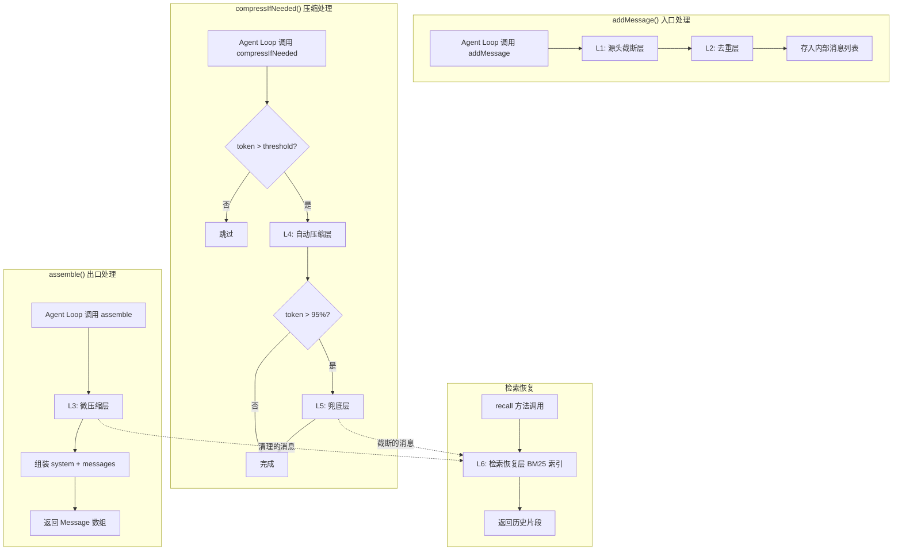

# ContextPipeline 设计文档

## 概述

ContextPipeline 是 Mako AI Coding Agent 的新一代上下文管理模块，采用 **5 层防御 + 检索恢复** 的管道式架构，替换现有的 ContextManager。该模块解决生产环境下长对话（100+ 轮、大量工具调用）的上下文爆炸问题。

### 设计目标

1. **接口兼容**：对外保持 `addMessage()` / `assemble()` 接口不变，Agent Loop 零修改切换
2. **分层防御**：源头截断 → 去重 → 微压缩 → 自动压缩 → 兜底，逐层削减 token 消耗
3. **信息可恢复**：被压缩/丢弃的内容通过 BM25 索引可检索恢复
4. **可配置**：每层独立启用/禁用，参数可调
5. **解耦**：仅依赖 Message 类型和 LLMAdapter 接口

### 设计决策

| 决策 | 选择 | 理由 |
|------|------|------|
| 管道模式 | 确定性顺序执行 | 保证结果可预测、可调试 |
| 检索引擎 | minisearch (BM25) | 轻量（~30KB）、纯 JS、无外部依赖 |
| Token 计数 | gpt-tokenizer | 项目已有依赖，准确度高 |
| 压缩策略 | 9 维结构化摘要 | 比自由摘要更可控，防止信息遗漏 |
| 去重方式 | SHA-256 内容哈希 | 快速、碰撞概率极低 |
| 工具分类 | 配置驱动 | 不硬编码工具名，支持扩展 |

## 架构

### 模块文件结构

```
packages/core/src/context/
├── context-pipeline.ts        # 主入口，ContextPipeline 类
├── context-manager.ts         # 旧实现（保留，逐步废弃）
├── token-counter.ts           # Token 计数（已有）
├── layers/
│   ├── types.ts               # 层接口定义
│   ├── truncation-layer.ts    # L1: 源头截断层
│   ├── deduplication-layer.ts # L2: 去重层
│   ├── micro-compression-layer.ts  # L3: 微压缩层
│   ├── auto-compression-layer.ts   # L4: 自动压缩层
│   ├── fallback-layer.ts      # L5: 兜底层
│   └── retrieval-layer.ts     # L6: 检索恢复层
├── pipeline-config.ts         # 配置类型与默认值
└── overflow-store.ts          # 溢出内容磁盘存储
```

### 数据流图



## 组件与接口

### 核心接口定义

```typescript
import type { Message } from '../types.js';
import type { LLMAdapter } from '../llm/types.js';

// ==================== 管道配置 ====================

export interface PipelineConfig {
  maxTokens: number;
  systemPrompt: string;
  sessionDir: string;

  /** 工具分类配置 */
  toolClassification: {
    readTools: string[];   // 只读工具名列表
    writeTools: string[];  // 写入工具名列表
  };

  /** 各层配置 */
  layers: {
    truncation: TruncationConfig;
    deduplication: DeduplicationConfig;
    microCompression: MicroCompressionConfig;
    autoCompression: AutoCompressionConfig;
    fallback: FallbackConfig;
    retrieval: RetrievalConfig;
  };
}

export interface TruncationConfig {
  enabled: boolean;
  /** 单个 Tool_Result 最大字符数，默认 50000 */
  singleResultLimit: number;
  /** 单条 assistant 关联的所有 Tool_Result 总字符数上限，默认 200000 */
  aggregateLimit: number;
  /** read_file 结果最大行数，默认 2000 */
  fileReadLineLimit: number;
  /** 溢出文件存储目录 */
  overflowDir: string;
}

export interface DeduplicationConfig {
  enabled: boolean;
}

export interface MicroCompressionConfig {
  enabled: boolean;
  /** 保留最近 N 轮的 READ_Tool 结果，默认 5 */
  keepRounds: number;
}

export interface AutoCompressionConfig {
  enabled: boolean;
  /** 触发压缩的 token 占比阈值，默认 0.8 */
  threshold: number;
  /** 压缩后恢复的最近文件数上限，默认 5 */
  maxRecentFiles: number;
}

export interface FallbackConfig {
  enabled: boolean;
  /** 兜底触发阈值（占 maxTokens 比例），默认 0.95 */
  triggerThreshold: number;
  /** 兜底目标（占 maxTokens 比例），默认 0.70 */
  targetThreshold: number;
  /** transcript 保存目录 */
  transcriptDir: string;
}

export interface RetrievalConfig {
  enabled: boolean;
  /** recall 默认返回条数，默认 5 */
  defaultTopK: number;
  /** transcript 目录（用于初始化时重建索引） */
  transcriptDir: string;
}
```

### 层接口

```typescript
// layers/types.ts

import type { Message } from '../../types.js';

/** 内部消息包装，附加元数据 */
export interface InternalMessage {
  message: Message;
  /** 所属轮次（user 消息递增） */
  round: number;
  /** 关联的工具调用 ID */
  toolCallId?: string;
  /** 关联的工具名称 */
  toolName?: string;
  /** 原始 token 数 */
  originalTokens: number;
  /** 是否已被压缩/清理 */
  compressed: boolean;
  /** 时间戳 */
  timestamp: number;
}

/** 入口层接口 — 在 addMessage 时执行 */
export interface IngressLayer {
  readonly name: string;
  readonly enabled: boolean;
  /** 处理单条消息，可能修改或替换 */
  process(
    msg: InternalMessage,
    context: LayerContext
  ): Promise<InternalMessage>;
}

/** 出口层接口 — 在 assemble 时执行 */
export interface EgressLayer {
  readonly name: string;
  readonly enabled: boolean;
  /** 处理整个消息列表，返回处理后的列表 */
  process(
    messages: InternalMessage[],
    context: LayerContext
  ): InternalMessage[];
}

/** 压缩层接口 — 在 compressIfNeeded 时执行 */
export interface CompressionLayer {
  readonly name: string;
  readonly enabled: boolean;
  /** 执行压缩，直接修改 pipeline 状态 */
  compress(context: CompressionContext): Promise<void>;
}

/** 层执行上下文 */
export interface LayerContext {
  /** 当前轮次 */
  currentRound: number;
  /** 工具分类查询 */
  isReadTool(toolName: string): boolean;
  isWriteTool(toolName: string): boolean;
  /** 获取当前 token 数 */
  getTokenCount(): number;
  /** 最大 token 数 */
  maxTokens: number;
}

/** 压缩层执行上下文 */
export interface CompressionContext extends LayerContext {
  /** 当前所有消息 */
  messages: InternalMessage[];
  /** 替换消息列表 */
  setMessages(messages: InternalMessage[]): void;
  /** LLM 适配器（用于生成摘要） */
  llm: LLMAdapter;
  /** 系统提示词 */
  systemPrompt: string;
  /** 索引消息到检索层 */
  indexMessages(messages: InternalMessage[]): void;
  /** 保存 transcript */
  saveTranscript(messages: InternalMessage[]): Promise<void>;
}
```

### ContextPipeline 主类

```typescript
// context-pipeline.ts

import type { Message } from '../types.js';
import type { LLMAdapter } from '../llm/types.js';
import type { InternalMessage, IngressLayer, EgressLayer, CompressionLayer } from './layers/types.js';
import type { PipelineConfig } from './pipeline-config.js';

export class ContextPipeline {
  private messages: InternalMessage[] = [];
  private currentRound: number = 0;
  private config: PipelineConfig;
  private llm: LLMAdapter;

  // 各层实例
  private ingressLayers: IngressLayer[];
  private egressLayers: EgressLayer[];
  private compressionLayers: CompressionLayer[];

  // 检索层（特殊，跨层共享）
  private retrievalLayer: RetrievalLayer;

  constructor(config: PipelineConfig, llm: LLMAdapter);

  /** 添加消息 — 经过入口层处理 */
  addMessage(message: Message): void;

  /** 组装上下文 — 经过出口层处理 */
  assemble(): Message[];

  /** 获取原始消息列表副本 */
  getMessages(): Message[];

  /** 清空所有状态 */
  clear(): void;

  /** 获取当前 token 数 */
  getTokenCount(): number;

  /** 需要时触发压缩 */
  compressIfNeeded(): Promise<void>;

  /** 检索历史消息 */
  recall(query: string, topK?: number): string[];

  /** 动态更新配置 */
  updateConfig(partial: Partial<PipelineConfig>): void;

  /** 保存会话 */
  save(sessionId: string): Promise<void>;

  /** 加载会话 */
  load(sessionId: string): Promise<void>;
}
```

## 数据模型

### InternalMessage 扩展

```typescript
/** 内部消息，在 Message 基础上附加管道元数据 */
export interface InternalMessage {
  message: Message;
  round: number;
  toolCallId?: string;
  toolName?: string;
  originalTokens: number;
  compressed: boolean;
  timestamp: number;
}
```

### 持久化数据格式

```typescript
/** 会话保存格式 */
interface SessionData {
  version: 1;
  sessionId: string;
  createdAt: string;
  updatedAt: string;
  currentRound: number;
  messages: InternalMessage[];
  hashCache: Record<string, { hash: string; round: number }>;
  indexState: MiniSearchExportData;  // minisearch 导出格式
}

/** Transcript 格式（兜底层保存） */
interface TranscriptData {
  sessionId: string;
  timestamp: string;
  messages: InternalMessage[];
  reason: 'fallback_truncation';
}

/** 溢出文件格式 */
interface OverflowFile {
  toolCallId: string;
  toolName: string;
  timestamp: string;
  content: string;
}
```

### BM25 索引文档结构

```typescript
/** minisearch 索引文档 */
interface IndexDocument {
  id: string;           // `${sessionId}_${round}_${index}`
  role: string;
  content: string;
  toolName: string;
  round: number;
  timestamp: number;
}
```


## 各层实现方案

### L1: 源头截断层 (TruncationLayer)

**职责**：在消息进入存储前，截断过大的工具结果。

**实现逻辑**：

```typescript
// layers/truncation-layer.ts

export class TruncationLayer implements IngressLayer {
  readonly name = 'truncation';

  async process(msg: InternalMessage, ctx: LayerContext): Promise<InternalMessage> {
    if (msg.message.role !== 'tool' || !msg.message.content) {
      return msg;
    }

    const content = msg.message.content;

    // 规则 1: read_file 行数限制
    if (msg.toolName === 'read_file') {
      const lines = content.split('\n');
      if (lines.length > this.config.fileReadLineLimit) {
        const truncated = lines.slice(0, this.config.fileReadLineLimit).join('\n');
        msg.message = {
          ...msg.message,
          content: truncated + `\n\n[截断提示: 文件共 ${lines.length} 行，仅显示前 ${this.config.fileReadLineLimit} 行]`
        };
        await this.saveOverflow(msg.toolCallId, content);
      }
    }

    // 规则 2: 单个结果字符数限制
    if (content.length > this.config.singleResultLimit) {
      const preview = content.split('\n').slice(0, 200).join('\n');
      const overflowPath = await this.saveOverflow(msg.toolCallId, content);
      msg.message = {
        ...msg.message,
        content: `${preview}\n\n[截断: 完整内容已保存至 ${overflowPath}]`
      };
    }

    return msg;
  }

  private async saveOverflow(toolCallId: string, content: string): Promise<string> {
    // 保存到 .mako/overflow/{timestamp}_{toolCallId}.txt
  }
}
```

**聚合截断**：在 `addMessage` 处理 assistant 消息时，检查其关联的所有 tool 结果总量，从最早的开始截断。

### L2: 去重层 (DeduplicationLayer)

**职责**：检测重复读取的文件，用存根替换。

**实现逻辑**：

```typescript
// layers/deduplication-layer.ts
import { createHash } from 'node:crypto';

export class DeduplicationLayer implements IngressLayer {
  readonly name = 'deduplication';

  /** 文件路径 → { hash, round } */
  private hashCache: Map<string, { hash: string; round: number }> = new Map();

  async process(msg: InternalMessage, ctx: LayerContext): Promise<InternalMessage> {
    if (msg.message.role !== 'tool' || msg.toolName !== 'read_file') {
      return msg;
    }

    const filePath = this.extractFilePath(msg);
    if (!filePath || !msg.message.content) return msg;

    const hash = createHash('sha256').update(msg.message.content).digest('hex');
    const cached = this.hashCache.get(filePath);

    if (cached && cached.hash === hash) {
      // 内容未变化，替换为存根
      msg.message = {
        ...msg.message,
        content: `[文件未变化: ${filePath}，内容与第 ${cached.round} 轮读取相同]`
      };
      msg.compressed = true;
    } else {
      // 新内容或内容已变化，更新缓存
      this.hashCache.set(filePath, { hash, round: ctx.currentRound });
    }

    return msg;
  }

  private extractFilePath(msg: InternalMessage): string | null {
    // 从关联的 assistant toolCalls 中提取 read_file 的 path 参数
    // 或从 tool result 内容的第一行提取路径
  }
}
```

### L3: 微压缩层 (MicroCompressionLayer)

**职责**：在 assemble 时清理旧的只读工具结果。

**实现逻辑**：

```typescript
// layers/micro-compression-layer.ts

export class MicroCompressionLayer implements EgressLayer {
  readonly name = 'microCompression';

  process(messages: InternalMessage[], ctx: LayerContext): InternalMessage[] {
    const threshold = ctx.currentRound - this.config.keepRounds;

    return messages.map(msg => {
      // 仅处理 tool 角色的消息
      if (msg.message.role !== 'tool') return msg;

      // 跳过 WRITE_Tool 结果（永远保留）
      if (msg.toolName && ctx.isWriteTool(msg.toolName)) return msg;

      // 超过 N 轮的 READ_Tool 结果替换为存根
      if (msg.round < threshold && msg.toolName && ctx.isReadTool(msg.toolName)) {
        // 索引到检索层
        ctx.indexToRetrieval?.(msg);

        return {
          ...msg,
          message: {
            ...msg.message,
            content: `[已清理: ${msg.toolName} 结果，第 ${msg.round} 轮]`
          },
          compressed: true,
        };
      }

      return msg;
    });
  }
}
```

### L4: 自动压缩层 (AutoCompressionLayer)

**职责**：当 token 超过阈值时，生成 9 维结构化摘要。

**9 维压缩提示词设计**：

```typescript
const COMPRESSION_PROMPT = `你是一个对话压缩助手。请将以下对话历史压缩为结构化摘要，严格按照以下 9 个维度输出：

## 1. 用户原始意图
用户最初想要完成什么任务？

## 2. 当前任务状态
任务进展到哪一步了？当前正在做什么？

## 3. 关键决策记录
对话中做出了哪些重要的技术/设计决策？

## 4. 已完成的操作
列出已经成功执行的操作（文件创建/修改、命令执行等）

## 5. 待完成的操作
还有哪些步骤需要完成？

## 6. 重要文件列表
列出当前任务涉及的关键文件路径及其用途

## 7. 错误和解决方案
遇到了哪些错误？如何解决的？

## 8. 用户偏好和约束
用户表达了哪些偏好或约束条件？

## 9. 最近用户消息原文
（以下为最近 3 条用户消息的原文引用，不要修改）
`;
```

**实现逻辑**：

```typescript
// layers/auto-compression-layer.ts

export class AutoCompressionLayer implements CompressionLayer {
  readonly name = 'autoCompression';

  async compress(ctx: CompressionContext): Promise<void> {
    const tokenCount = ctx.getTokenCount();
    const threshold = ctx.maxTokens * this.config.threshold;

    if (tokenCount <= threshold) return;

    // 1. 提取最近 3 条 user 消息原文
    const recentUserMessages = ctx.messages
      .filter(m => m.message.role === 'user')
      .slice(-3)
      .map(m => m.message.content);

    // 2. 构建压缩请求
    const conversationText = ctx.messages
      .map(m => `[${m.message.role}][R${m.round}]: ${m.message.content ?? JSON.stringify(m.message.toolCalls)}`)
      .join('\n');

    const prompt = COMPRESSION_PROMPT +
      recentUserMessages.map((c, i) => `\n### 用户消息 ${i + 1}\n${c}`).join('') +
      '\n\n---\n\n以下是需要压缩的对话历史：\n\n' + conversationText;

    // 3. 调用 LLM 生成摘要
    const response = await ctx.llm.chat([
      { role: 'system', content: '你是一个对话压缩助手。' },
      { role: 'user', content: prompt },
    ]);

    if (response.type !== 'text') return;

    // 4. 索引被压缩的消息
    ctx.indexMessages(ctx.messages);

    // 5. 构建压缩后的消息列表
    const summaryMessage: InternalMessage = {
      message: { role: 'system', content: `[对话摘要]:\n${response.content}` },
      round: ctx.currentRound,
      originalTokens: 0,
      compressed: true,
      timestamp: Date.now(),
    };

    // 6. 恢复最近读取的文件（最多 maxRecentFiles 个）
    const recentFiles = this.getRecentFileReads(ctx.messages, this.config.maxRecentFiles);

    // 7. 保留最近的消息（最后一轮）
    const lastRoundMessages = ctx.messages.filter(m => m.round === ctx.currentRound);

    // 8. 续接指令
    const continuationMessage: InternalMessage = {
      message: {
        role: 'system',
        content: '[系统提示: 上下文已压缩。请直接继续执行任务，无需确认或重复摘要内容。]'
      },
      round: ctx.currentRound,
      originalTokens: 0,
      compressed: false,
      timestamp: Date.now(),
    };

    ctx.setMessages([
      summaryMessage,
      ...recentFiles,
      ...lastRoundMessages,
      continuationMessage,
    ]);
  }

  private getRecentFileReads(messages: InternalMessage[], max: number): InternalMessage[] {
    // 从后往前找最近的 read_file 结果，去重（同路径只保留最新）
    const seen = new Set<string>();
    const result: InternalMessage[] = [];

    for (let i = messages.length - 1; i >= 0 && result.length < max; i--) {
      const msg = messages[i];
      if (msg.toolName === 'read_file' && !msg.compressed) {
        const path = this.extractPath(msg);
        if (path && !seen.has(path)) {
          seen.add(path);
          result.unshift(msg);
        }
      }
    }
    return result;
  }
}
```

### L5: 兜底层 (FallbackLayer)

**职责**：自动压缩后仍超限时的最终保护。

**实现逻辑**：

```typescript
// layers/fallback-layer.ts

export class FallbackLayer implements CompressionLayer {
  readonly name = 'fallback';

  async compress(ctx: CompressionContext): Promise<void> {
    const tokenCount = ctx.getTokenCount();
    const triggerLimit = ctx.maxTokens * this.config.triggerThreshold; // 95%
    const targetLimit = ctx.maxTokens * this.config.targetThreshold;  // 70%

    if (tokenCount <= triggerLimit) return;

    // 1. 保存完整对话到 transcript
    await ctx.saveTranscript(ctx.messages);

    // 2. 索引所有消息到检索层
    ctx.indexMessages(ctx.messages);

    // 3. 从最早的消息组开始逐组截断
    const messages = [...ctx.messages];
    while (this.calculateTokens(messages) > targetLimit && messages.length > 1) {
      // 找到最早一轮的所有消息，整组移除
      const earliestRound = messages[0].round;
      const cutIndex = messages.findIndex(m => m.round !== earliestRound);
      if (cutIndex === -1) break;
      messages.splice(0, cutIndex);
    }

    // 4. 插入归档提示
    const archiveNotice: InternalMessage = {
      message: {
        role: 'system',
        content: '[系统提示: 早期对话已归档。如需回顾历史信息，请使用 recall 工具搜索。]'
      },
      round: ctx.currentRound,
      originalTokens: 0,
      compressed: false,
      timestamp: Date.now(),
    };

    ctx.setMessages([archiveNotice, ...messages]);
  }
}
```

### L6: 检索恢复层 (RetrievalLayer)

**职责**：维护 BM25 索引，支持关键词搜索恢复历史内容。

**BM25 索引集成方案**：

```typescript
// layers/retrieval-layer.ts
import MiniSearch from 'minisearch';

export class RetrievalLayer {
  private index: MiniSearch<IndexDocument>;

  constructor(config: RetrievalConfig) {
    this.index = new MiniSearch<IndexDocument>({
      fields: ['content', 'toolName', 'role'],
      storeFields: ['content', 'role', 'toolName', 'round', 'timestamp'],
      searchOptions: {
        boost: { content: 2, toolName: 1 },
        fuzzy: 0.2,
        prefix: true,
      },
    });
  }

  /** 索引消息（被清理/截断时调用） */
  indexMessages(messages: InternalMessage[]): void {
    const docs: IndexDocument[] = messages
      .filter(m => m.message.content && !m.compressed)
      .map((m, i) => ({
        id: `${m.round}_${m.timestamp}_${i}`,
        role: m.message.role,
        content: m.message.content!,
        toolName: m.toolName ?? '',
        round: m.round,
        timestamp: m.timestamp,
      }));

    // 避免重复索引
    for (const doc of docs) {
      if (!this.index.has(doc.id)) {
        this.index.add(doc);
      }
    }
  }

  /** 搜索历史消息 */
  recall(query: string, topK: number = 5): string[] {
    const results = this.index.search(query, { limit: topK });

    return results.map(r => {
      const doc = r as unknown as IndexDocument;
      return `[第 ${doc.round} 轮][${doc.role}${doc.toolName ? `/${doc.toolName}` : ''}]: ${doc.content}`;
    });
  }

  /** 从 transcript 文件重建索引 */
  async loadFromTranscripts(transcriptDir: string): Promise<void> {
    // 读取 transcriptDir 下所有 JSON 文件
    // 解析为 TranscriptData，提取消息并索引
  }

  /** 导出索引状态（用于持久化） */
  exportState(): object {
    return this.index.toJSON();
  }

  /** 从导出状态恢复索引 */
  importState(state: object): void {
    this.index = MiniSearch.loadJSON(JSON.stringify(state), {
      fields: ['content', 'toolName', 'role'],
      storeFields: ['content', 'role', 'toolName', 'round', 'timestamp'],
    });
  }
}
```

## 迁移方案

### 从 ContextManager 切换到 ContextPipeline

由于 ContextPipeline 保持相同的外部接口，迁移是无缝的：

```typescript
// agent.ts 中的修改（仅需改一行）

// 旧代码:
// import { ContextManager } from './context/context-manager.js';
// this.context = new ContextManager(config.systemPrompt, config.contextConfig, llm);

// 新代码:
import { ContextPipeline } from './context/context-pipeline.js';
import { createDefaultPipelineConfig } from './context/pipeline-config.js';

// 在 Agent 构造函数中:
const pipelineConfig = createDefaultPipelineConfig({
  maxTokens: config.contextConfig.maxTokens,
  systemPrompt: config.systemPrompt,
  sessionDir: config.contextConfig.sessionDir,
});
this.context = new ContextPipeline(pipelineConfig, llm);
```

### 默认配置工厂

```typescript
// pipeline-config.ts

export function createDefaultPipelineConfig(
  overrides: Partial<Pick<PipelineConfig, 'maxTokens' | 'systemPrompt' | 'sessionDir'>>
): PipelineConfig {
  return {
    maxTokens: overrides.maxTokens ?? 128000,
    systemPrompt: overrides.systemPrompt ?? '',
    sessionDir: overrides.sessionDir ?? '.mako/sessions',
    toolClassification: {
      readTools: ['read_file', 'bash', 'search', 'list_directory', 'fetch_url'],
      writeTools: ['write_file', 'replace_in_file'],
    },
    layers: {
      truncation: {
        enabled: true,
        singleResultLimit: 50000,
        aggregateLimit: 200000,
        fileReadLineLimit: 2000,
        overflowDir: '.mako/overflow',
      },
      deduplication: { enabled: true },
      microCompression: { enabled: true, keepRounds: 5 },
      autoCompression: { enabled: true, threshold: 0.8, maxRecentFiles: 5 },
      fallback: {
        enabled: true,
        triggerThreshold: 0.95,
        targetThreshold: 0.70,
        transcriptDir: '.mako/transcripts',
      },
      retrieval: {
        enabled: true,
        defaultTopK: 5,
        transcriptDir: '.mako/transcripts',
      },
    },
  };
}
```

### 向后兼容

- `ContextManager` 保留但标记为 `@deprecated`
- Agent 类通过类型联合支持两种实现：`context: ContextManager | ContextPipeline`
- 旧的 session JSON 格式可被 `ContextPipeline.load()` 兼容读取（检测 version 字段）


## 正确性属性

*正确性属性是一种在系统所有有效执行中都应成立的特征或行为——本质上是对系统应做什么的形式化陈述。属性是人类可读规范与机器可验证正确性保证之间的桥梁。*

### Property 1: 消息存储往返一致性

*对于任意*有效的 Message 对象序列，依次调用 `addMessage()` 后，`getMessages()` 返回的列表应包含所有已添加的消息（可能经过截断/去重处理），且返回的是副本——对返回数组的修改不应影响内部状态。

**Validates: Requirements 1.1, 1.3**

### Property 2: Token 计数一致性

*对于任意*消息列表状态，`getTokenCount()` 的返回值应等于 system prompt 的 token 数加上所有当前存储消息的 token 数之和（含格式开销）。

**Validates: Requirements 1.5**

### Property 3: 配置默认值合并

*对于任意*部分 PipelineConfig（缺少某些字段），构造 ContextPipeline 后的有效配置应包含所有必需字段，缺失字段使用预定义的默认值填充。

**Validates: Requirements 2.3**

### Property 4: 禁用层透传

*对于任意*层配置中 `enabled: false` 的层，经过该层处理的消息应与输入完全相同（即该层不产生任何副作用或修改）。

**Validates: Requirements 2.2, 10.4**

### Property 5: 单条结果截断

*对于任意*字符数超过 `singleResultLimit` 的 Tool_Result 消息，经过源头截断层处理后，存储的消息内容长度应小于 `singleResultLimit + 合理的元数据开销`，且完整内容应被保存到 overflow 目录。

**Validates: Requirements 3.1**

### Property 6: 聚合结果截断

*对于任意*一组关联的 Tool_Result 消息，当其字符总和超过 `aggregateLimit` 时，经过处理后的总字符数应不超过 `aggregateLimit`。

**Validates: Requirements 3.2**

### Property 7: 行数截断

*对于任意* read_file 工具结果，当行数超过 `fileReadLineLimit` 时，处理后的内容行数应等于 `fileReadLineLimit`（不含截断提示行）。

**Validates: Requirements 3.3**

### Property 8: 去重正确性

*对于任意*文件路径和文件内容，连续两次以相同内容调用 `addMessage()`（模拟重复读取），第二次存储的消息应为存根格式；若第二次内容不同，则应保留完整内容并更新哈希缓存。

**Validates: Requirements 4.2, 4.3**

### Property 9: 微压缩保留写入工具结果

*对于任意*消息列表，`assemble()` 返回的结果中，所有 WRITE_Tool 类型的 Tool_Result 消息应保持完整内容不变，无论其所属轮次距当前轮次多远。同时，超过 `keepRounds` 轮的 READ_Tool 结果应被替换为存根。

**Validates: Requirements 5.1, 5.2, 5.3**

### Property 10: 压缩阈值触发

*对于任意*上下文状态，当 `getTokenCount() > maxTokens * threshold` 时调用 `compressIfNeeded()`，压缩流程应被触发；当 `getTokenCount() <= maxTokens * threshold` 时，消息列表应保持不变。

**Validates: Requirements 6.1**

### Property 11: 压缩摘要结构完整性

*对于任意*触发自动压缩的对话历史，生成的 Compression_Summary 应包含全部 9 个维度的内容，且第 9 维应包含最近 3 条（或全部，若不足 3 条）user 消息的原文。

**Validates: Requirements 6.2, 6.3**

### Property 12: 兜底层 token 目标

*对于任意*自动压缩后仍超过 `maxTokens * 0.95` 的状态，兜底层执行后的 token 数应不超过 `maxTokens * 0.70`。

**Validates: Requirements 7.1**

### Property 13: 检索恢复可达性

*对于任意*被微压缩层清理或兜底层截断的消息，使用该消息内容中的关键词调用 `recall()` 应能在结果中找到该消息的内容。

**Validates: Requirements 8.1, 8.2**

### Property 14: 检索结果数量限制

*对于任意*查询和 topK 参数，`recall()` 返回的结果数量应不超过 topK。

**Validates: Requirements 8.4**

### Property 15: 持久化往返一致性

*对于任意* ContextPipeline 状态，执行 `save(id)` 后再执行 `load(id)`，恢复后的 `getMessages()` 应与保存前的 `getMessages()` 返回相同的消息列表。

**Validates: Requirements 9.1, 9.2**

### Property 16: 工具分类配置驱动

*对于任意*自定义的 `toolClassification` 配置（将某工具归为 READ 或 WRITE），微压缩层应按照配置而非硬编码名称来决定是否清理该工具的结果。

**Validates: Requirements 11.4**

## 错误处理

### 错误处理策略

| 场景 | 处理方式 | 理由 |
|------|----------|------|
| LLM 压缩调用失败 | 跳过本次压缩，保持原状态，下次 compressIfNeeded 重试 | 压缩失败不应阻塞对话 |
| overflow 文件写入失败 | 记录警告日志，保留截断后的内容（不含磁盘路径引用） | 磁盘问题不应阻塞消息处理 |
| transcript 保存失败 | 记录错误日志，继续执行兜底截断 | 归档失败不应阻止兜底保护 |
| session 加载失败 | 保持空状态，静默处理 | 符合 Requirement 9.3 |
| minisearch 索引损坏 | 重建空索引，记录警告 | 索引可从 transcript 重建 |
| Token 计数异常 | 使用字符数 / 4 作为估算值 | 降级但不中断 |
| 配置值非法 | 使用默认值替代，记录警告 | 容错优先 |

### 错误传播原则

1. **管道层错误不向上传播**：任何层的处理错误都在层内捕获，消息原样传递到下一层
2. **I/O 错误静默降级**：磁盘操作失败不影响核心消息处理流程
3. **LLM 错误可重试**：压缩失败保留状态，等待下次触发
4. **关键错误记录日志**：通过可选的 `logger` 接口输出诊断信息

```typescript
/** 可选的日志接口 */
export interface PipelineLogger {
  warn(message: string, context?: Record<string, unknown>): void;
  error(message: string, context?: Record<string, unknown>): void;
}
```

## 测试策略

### 测试框架

- **单元测试**：Vitest（项目已有配置）
- **属性测试**：fast-check（property-based testing 库）
- **最低迭代次数**：每个属性测试 100 次

### 属性测试（Property-Based Tests）

每个正确性属性对应一个属性测试，使用 fast-check 生成随机输入：

```typescript
import { fc } from '@fast-check/vitest';

// Feature: context-pipeline, Property 1: 消息存储往返一致性
test.prop([fc.array(arbitraryMessage())])('addMessage 后 getMessages 包含所有消息', (messages) => {
  const pipeline = createTestPipeline({ layers: { truncation: { enabled: false }, deduplication: { enabled: false } } });
  for (const msg of messages) {
    pipeline.addMessage(msg);
  }
  const stored = pipeline.getMessages();
  expect(stored.length).toBe(messages.length);
  // 修改返回值不影响内部状态
  stored.push({ role: 'user', content: 'injected' });
  expect(pipeline.getMessages().length).toBe(messages.length);
});
```

### 自定义 Arbitrary 生成器

```typescript
// 生成有效的 Message
function arbitraryMessage(): fc.Arbitrary<Message> {
  return fc.oneof(
    fc.record({
      role: fc.constant('user' as const),
      content: fc.string({ minLength: 1, maxLength: 1000 }),
    }),
    fc.record({
      role: fc.constant('assistant' as const),
      content: fc.string({ minLength: 1, maxLength: 1000 }),
    }),
    fc.record({
      role: fc.constant('tool' as const),
      content: fc.string({ minLength: 1, maxLength: 5000 }),
      toolCallId: fc.uuid(),
    }),
  );
}

// 生成大型 Tool_Result（用于截断测试）
function arbitraryLargeToolResult(minChars: number): fc.Arbitrary<Message> {
  return fc.record({
    role: fc.constant('tool' as const),
    content: fc.string({ minLength: minChars, maxLength: minChars * 2 }),
    toolCallId: fc.uuid(),
  });
}
```

### 单元测试覆盖

| 模块 | 测试重点 |
|------|----------|
| TruncationLayer | 边界值（恰好 50000 字符）、多行文件截断、overflow 文件格式 |
| DeduplicationLayer | 哈希计算正确性、路径提取、缓存更新 |
| MicroCompressionLayer | 轮次边界、工具分类、存根格式 |
| AutoCompressionLayer | 9 维 prompt 构建、恢复文件选择、续接指令 |
| FallbackLayer | 逐组截断逻辑、transcript 保存格式 |
| RetrievalLayer | minisearch 索引/搜索、导出/导入、topK 限制 |
| ContextPipeline | 接口兼容性、层执行顺序、配置合并 |

### 集成测试

- 完整管道端到端：模拟 100 轮对话，验证 token 始终在限制内
- 持久化往返：save → load → 验证状态一致
- 压缩触发：填充消息至阈值，验证压缩行为
- 检索恢复：清理消息后通过 recall 找回

### 测试配置

```typescript
// vitest.config.ts 中已有配置，属性测试使用 @fast-check/vitest 集成
// 每个属性测试标注对应的 Property 编号
// 格式: Feature: context-pipeline, Property {N}: {title}
```
