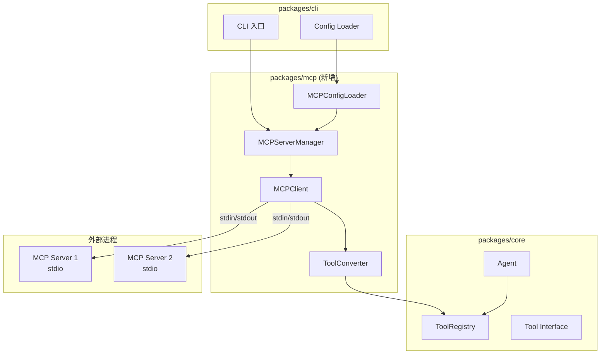
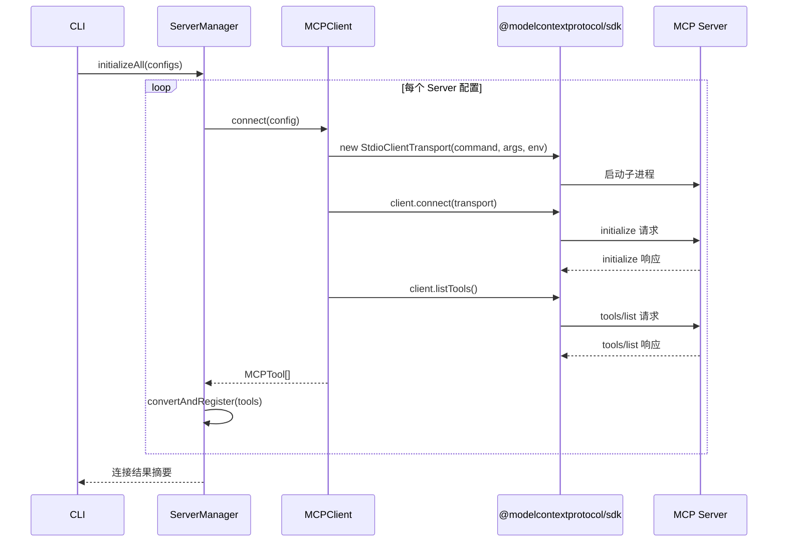

# 设计文档: MCP Client

## 概述

本设计文档描述 Mako AI 编程助手的 MCP（Model Context Protocol）客户端实现方案。MCP Client 作为独立包 `packages/mcp/` 存在于 monorepo 中，负责：

1. 从 `.mako/config.json` 加载 MCP Server 配置
2. 通过 stdio 传输层与 MCP Server 建立连接
3. 自动发现 MCP Server 提供的工具
4. 将 MCP 工具转换为 Mako Tool 接口格式并注册到 ToolRegistry
5. 转发 Agent 的工具调用请求到对应的 MCP Server
6. 管理 MCP Server 子进程的生命周期

核心依赖：`@modelcontextprotocol/sdk`（官方 MCP TypeScript SDK），利用其提供的 `Client`、`StdioClientTransport` 等类简化协议实现。

## 架构



### 连接生命周期



## 组件与接口

### 包结构

```
packages/mcp/
├── package.json
├── tsconfig.json
├── tsup.config.ts
├── src/
│   ├── index.ts              # 公共导出
│   ├── types.ts              # 类型定义
│   ├── config-loader.ts      # MCP 配置加载
│   ├── mcp-client.ts         # 单个 MCP Server 连接客户端
│   ├── server-manager.ts     # 多 Server 生命周期管理
│   ├── tool-converter.ts     # MCP Tool → Mako Tool 转换
│   └── errors.ts             # 错误类型定义
└── __tests__/
    ├── config-loader.test.ts
    ├── tool-converter.test.ts
    ├── tool-converter.property.test.ts
    ├── server-manager.test.ts
    └── integration/
        └── mcp-client.integration.test.ts
```

### TypeScript 接口定义

```typescript
// src/types.ts

/** 单个 MCP Server 的配置 */
export interface MCPServerConfig {
  /** Server 标识名称（config 中的 key） */
  name: string;
  /** 启动命令 */
  command: string;
  /** 命令参数 */
  args?: string[];
  /** 注入到子进程的环境变量 */
  env?: Record<string, string>;
  /** 免确认的工具列表 */
  alwaysAllow?: string[];
}

/** 从 config.json 加载的完整 MCP 配置 */
export interface MCPConfig {
  servers: MCPServerConfig[];
}

/** MCP Server 连接状态 */
export type MCPServerStatus = 'connecting' | 'connected' | 'disconnected' | 'error';

/** MCP Server 运行时信息 */
export interface MCPServerInfo {
  name: string;
  status: MCPServerStatus;
  tools: string[];
  error?: string;
}

/** MCP 工具的原始定义（来自 tools/list 响应） */
export interface MCPToolDefinition {
  name: string;
  description?: string;
  inputSchema: Record<string, unknown>;
}

/** 工具调用结果 */
export interface MCPToolCallResult {
  content: string;
  isError: boolean;
}
```

### MCPConfigLoader

```typescript
// src/config-loader.ts

import type { MCPConfig, MCPServerConfig } from './types.js';

export interface MCPConfigLoaderOptions {
  configPath: string;
}

/**
 * 从 .mako/config.json 的 mcpServers 字段加载 MCP Server 配置。
 * 
 * 配置格式：
 * {
 *   "mcpServers": {
 *     "serverName": {
 *       "command": "npx",
 *       "args": ["-y", "@modelcontextprotocol/server-filesystem", "/path"],
 *       "env": { "KEY": "value" },
 *       "alwaysAllow": ["tool1", "tool2"]
 *     }
 *   }
 * }
 */
export function loadMCPConfig(configPath: string): MCPConfig {
  // 读取并解析 config.json
  // 提取 mcpServers 字段
  // 验证每个 server 配置的 command 字段
  // 返回 MCPConfig，跳过无效配置并记录警告
}

/**
 * 验证单个 Server 配置是否有效。
 * 必须包含 command 字段。
 */
export function validateServerConfig(
  name: string,
  raw: Record<string, unknown>
): MCPServerConfig | null {
  // 验证 command 存在且为非空字符串
  // 解析 args（默认 []）
  // 解析 env（默认 {}）
  // 解析 alwaysAllow（默认 []）
  // 无效时返回 null 并记录错误
}
```

### MCPClient

```typescript
// src/mcp-client.ts

import { Client } from '@modelcontextprotocol/sdk/client/index.js';
import { StdioClientTransport } from '@modelcontextprotocol/sdk/client/stdio.js';
import type { MCPServerConfig, MCPToolDefinition, MCPToolCallResult, MCPServerStatus } from './types.js';

/**
 * 单个 MCP Server 的连接客户端。
 * 封装 @modelcontextprotocol/sdk 的 Client，提供简化的 API。
 */
export class MCPClient {
  private client: Client;
  private transport: StdioClientTransport | null = null;
  private config: MCPServerConfig;
  private _status: MCPServerStatus = 'disconnected';
  private _tools: MCPToolDefinition[] = [];

  constructor(config: MCPServerConfig) {
    this.config = config;
    this.client = new Client(
      { name: 'mako', version: '0.1.0' },
      { capabilities: {} }
    );
  }

  get status(): MCPServerStatus { return this._status; }
  get tools(): MCPToolDefinition[] { return this._tools; }
  get serverName(): string { return this.config.name; }

  /**
   * 连接到 MCP Server：启动子进程 → 协议握手 → 发现工具
   * @throws MCPConnectionError 连接失败时
   */
  async connect(): Promise<MCPToolDefinition[]> {
    // 1. 创建 StdioClientTransport（command, args, env）
    // 2. 调用 client.connect(transport) 完成 initialize 握手
    // 3. 调用 client.listTools() 获取工具列表
    // 4. 监听 transport 的 close/error 事件
    // 5. 更新状态为 connected
    // 6. 返回工具列表
  }

  /**
   * 调用 MCP Server 上的工具
   * @param toolName 原始工具名称（不含前缀）
   * @param args 调用参数
   */
  async callTool(toolName: string, args: Record<string, unknown>): Promise<MCPToolCallResult> {
    // 1. 检查 status 是否为 connected
    // 2. 调用 client.callTool({ name: toolName, arguments: args })
    // 3. 提取响应中的 content 文本
    // 4. 处理超时（30 秒）
    // 5. 返回 MCPToolCallResult
  }

  /**
   * 断开连接并终止子进程
   */
  async disconnect(): Promise<void> {
    // 1. 调用 transport.close()
    // 2. 更新状态为 disconnected
  }
}
```

### MCPServerManager

```typescript
// src/server-manager.ts

import type { Tool } from '@mako/core';
import type { ToolRegistry } from '@mako/core';
import type { MCPServerConfig, MCPServerInfo } from './types.js';
import { MCPClient } from './mcp-client.js';
import { convertMCPTools } from './tool-converter.js';

/**
 * 管理所有 MCP Server 的生命周期。
 * 负责启动、监控、停止和重启 MCP Server。
 */
export class MCPServerManager {
  private clients: Map<string, MCPClient> = new Map();
  private toolRegistry: ToolRegistry;
  private configs: MCPServerConfig[];

  constructor(configs: MCPServerConfig[], toolRegistry: ToolRegistry) {
    this.configs = configs;
    this.toolRegistry = toolRegistry;
  }

  /**
   * 初始化所有配置的 MCP Server。
   * 单个 Server 失败不影响其他 Server。
   * @returns 连接结果摘要
   */
  async initializeAll(): Promise<MCPServerInfo[]> {
    // 按配置顺序逐个连接
    // 每个 Server 独立 try/catch
    // 连接成功后转换工具并注册
    // 返回所有 Server 的状态信息
  }

  /**
   * 重启指定的 MCP Server
   */
  async restartServer(name: string): Promise<MCPServerInfo> {
    // 1. 从 registry 移除该 server 的工具
    // 2. 断开旧连接
    // 3. 重新连接
    // 4. 重新注册工具
  }

  /**
   * 关闭所有 MCP Server 连接。
   * 发送 SIGTERM，5 秒后 SIGKILL。
   */
  async shutdownAll(): Promise<void> {
    // 并行关闭所有 client
    // 设置 5 秒超时强制终止
  }

  /**
   * 获取所有 Server 的状态信息
   */
  getServerInfos(): MCPServerInfo[] {
    // 返回每个 server 的 name, status, tools, error
  }

  /**
   * 获取需要确认的危险工具集合。
   * 所有 MCP 工具默认为危险工具，除非在 alwaysAllow 中。
   */
  getDangerousTools(): Set<string> {
    // 遍历所有 server 的工具
    // 排除 alwaysAllow 中的工具
    // 返回需要确认的工具名称集合
  }
}
```

### ToolConverter

```typescript
// src/tool-converter.ts

import type { Tool } from '@mako/core';
import type { MCPToolDefinition } from './types.js';
import type { MCPClient } from './mcp-client.js';

/**
 * 生成带前缀的 Mako 工具名称。
 * 格式：mcp_{serverName}_{toolName}
 */
export function buildMakoToolName(serverName: string, mcpToolName: string): string {
  return `mcp_${serverName}_${mcpToolName}`;
}

/**
 * 从带前缀的 Mako 工具名称中提取原始 MCP 工具名称。
 * 输入：mcp_{serverName}_{toolName}
 * 输出：toolName
 */
export function extractMCPToolName(makoToolName: string, serverName: string): string {
  const prefix = `mcp_${serverName}_`;
  if (makoToolName.startsWith(prefix)) {
    return makoToolName.slice(prefix.length);
  }
  return makoToolName;
}

/**
 * 将 MCP 工具列表转换为 Mako Tool 数组。
 * 每个工具的 execute 方法会通过 MCPClient 转发调用。
 */
export function convertMCPTools(
  serverName: string,
  tools: MCPToolDefinition[],
  client: MCPClient
): Tool[] {
  return tools.map((mcpTool) => ({
    name: buildMakoToolName(serverName, mcpTool.name),
    description: mcpTool.description || '',
    parameters: mcpTool.inputSchema,
    execute: async (args: Record<string, unknown>): Promise<string> => {
      const result = await client.callTool(mcpTool.name, args);
      if (result.isError) {
        throw new Error(result.content);
      }
      return result.content;
    },
  }));
}
```

### 错误类型

```typescript
// src/errors.ts

export class MCPError extends Error {
  constructor(message: string, public readonly serverName: string) {
    super(`[MCP:${serverName}] ${message}`);
    this.name = 'MCPError';
  }
}

export class MCPConnectionError extends MCPError {
  constructor(serverName: string, cause: string) {
    super(`连接失败: ${cause}`, serverName);
    this.name = 'MCPConnectionError';
  }
}

export class MCPTimeoutError extends MCPError {
  constructor(serverName: string, operation: string, timeoutMs: number) {
    super(`${operation} 超时 (${timeoutMs}ms)`, serverName);
    this.name = 'MCPTimeoutError';
  }
}

export class MCPToolCallError extends MCPError {
  constructor(serverName: string, toolName: string, cause: string) {
    super(`工具调用失败 [${toolName}]: ${cause}`, serverName);
    this.name = 'MCPToolCallError';
  }
}

export class MCPServerUnavailableError extends MCPError {
  constructor(serverName: string) {
    super('Server 不可用', serverName);
    this.name = 'MCPServerUnavailableError';
  }
}
```

### 公共导出

```typescript
// src/index.ts

export type {
  MCPServerConfig,
  MCPConfig,
  MCPServerStatus,
  MCPServerInfo,
  MCPToolDefinition,
  MCPToolCallResult,
} from './types.js';

export { loadMCPConfig, validateServerConfig } from './config-loader.js';
export { MCPClient } from './mcp-client.js';
export { MCPServerManager } from './server-manager.js';
export { convertMCPTools, buildMakoToolName, extractMCPToolName } from './tool-converter.js';
export { MCPError, MCPConnectionError, MCPTimeoutError, MCPToolCallError, MCPServerUnavailableError } from './errors.js';
```

## 数据模型

### 配置文件格式（`.mako/config.json`）

```json
{
  "llm": { "..." : "..." },
  "agent": { "..." : "..." },
  "mcpServers": {
    "filesystem": {
      "command": "npx",
      "args": ["-y", "@modelcontextprotocol/server-filesystem", "/home/user/projects"],
      "env": {},
      "alwaysAllow": ["read_file", "list_directory"]
    },
    "github": {
      "command": "npx",
      "args": ["-y", "@modelcontextprotocol/server-github"],
      "env": {
        "GITHUB_TOKEN": "ghp_xxxx"
      },
      "alwaysAllow": []
    }
  }
}
```

### 工具名称映射

| MCP Server Name | MCP Tool Name | Mako Tool Name |
|---|---|---|
| filesystem | read_file | mcp_filesystem_read_file |
| filesystem | write_file | mcp_filesystem_write_file |
| github | create_issue | mcp_github_create_issue |

### MCP 协议消息流（JSON-RPC 2.0）

```
→ Client: { "jsonrpc": "2.0", "id": 1, "method": "initialize", "params": {...} }
← Server: { "jsonrpc": "2.0", "id": 1, "result": { "capabilities": {...} } }

→ Client: { "jsonrpc": "2.0", "id": 2, "method": "tools/list" }
← Server: { "jsonrpc": "2.0", "id": 2, "result": { "tools": [...] } }

→ Client: { "jsonrpc": "2.0", "id": 3, "method": "tools/call", "params": { "name": "read_file", "arguments": {...} } }
← Server: { "jsonrpc": "2.0", "id": 3, "result": { "content": [{ "type": "text", "text": "..." }] } }
```

## 正确性属性

*属性（Property）是一种在系统所有有效执行中都应成立的特征或行为——本质上是对系统应做什么的形式化陈述。属性是人类可读规格说明与机器可验证正确性保证之间的桥梁。*

### Property 1: 配置解析往返一致性

*对于任意*有效的 MCP Server 配置对象（包含 command、args、env 字段），将其序列化为 config.json 格式后再通过 `loadMCPConfig` 解析，应当产生等价的 `MCPServerConfig` 对象，所有字段值保持不变。

**Validates: Requirements 1.1, 1.2**

### Property 2: 无效配置过滤

*对于任意*一组 MCP Server 配置，其中部分配置缺少 `command` 字段，`loadMCPConfig` 返回的结果应当仅包含具有有效 `command` 字段的配置，且无效配置的数量等于总配置数减去返回结果数。

**Validates: Requirements 1.4**

### Property 3: 工具转换保持字段完整性

*对于任意* MCP 工具定义（包含 name、description、inputSchema），经过 `convertMCPTools` 转换后的 Mako Tool 应当满足：name 为 `mcp_{serverName}_{originalName}` 格式，description 与原始值相同，parameters 与原始 inputSchema 相同。

**Validates: Requirements 4.1, 4.2, 4.3**

### Property 4: 工具名称前缀往返一致性

*对于任意*合法的 server 名称和工具名称，`extractMCPToolName(buildMakoToolName(serverName, toolName), serverName)` 应当返回原始的 `toolName`。

**Validates: Requirements 4.1, 6.2**

### Property 5: 注册完整性

*对于任意*一组不重名的 MCP 工具，经过转换并注册到 ToolRegistry 后，`registry.list()` 返回的工具集合应当包含所有已注册的内置工具和所有 MCP 工具，总数等于内置工具数加 MCP 工具数。

**Validates: Requirements 5.1, 5.2**

### Property 6: 重复工具跳过

*对于任意*一组 MCP 工具，若其中存在与已注册工具同名的工具，注册过程应当跳过重复工具，最终 registry 中不会出现重复名称，且 registry 大小等于去重后的工具总数。

**Validates: Requirements 5.3**

### Property 7: 响应内容提取

*对于任意* MCP Server 的成功响应（包含 content 数组，每个元素有 type 和 text 字段），`callTool` 返回的 content 应当是所有 type 为 "text" 的元素的 text 字段拼接结果。对于错误响应，返回的 isError 应为 true 且 content 包含错误信息。

**Validates: Requirements 6.3, 6.4**

### Property 8: 不可用 Server 的工具调用

*对于任意*处于 `disconnected` 或 `error` 状态的 MCP Server，对该 Server 的任何工具调用都应当返回包含 "Server 不可用" 的错误信息，而不会尝试实际的网络通信。

**Validates: Requirements 8.4**

### Property 9: 危险工具分类与 alwaysAllow 过滤

*对于任意*一组 MCP 工具和 `alwaysAllow` 配置列表，`getDangerousTools()` 返回的集合应当包含所有不在 `alwaysAllow` 列表中的 MCP 工具，且不包含任何在 `alwaysAllow` 列表中的工具。

**Validates: Requirements 10.1, 10.2**

## 错误处理

### 错误分类与处理策略

| 错误场景 | 错误类型 | 处理策略 |
|---|---|---|
| 配置文件不存在 | — | 跳过 MCP 初始化，正常启动 |
| 配置格式错误 | MCPError | 记录警告，跳过无效 Server |
| 命令不存在 | MCPConnectionError | 记录错误，标记 Server 不可用 |
| 连接超时（30s） | MCPTimeoutError | 记录错误，标记 Server 不可用 |
| 协议握手失败 | MCPConnectionError | 记录错误，标记 Server 不可用 |
| tools/list 失败 | MCPError | 记录错误，标记 Server 不可用 |
| 工具调用超时（30s） | MCPTimeoutError | 返回超时错误给 Agent |
| Server 进程崩溃 | MCPError | 标记不可用，记录错误 |
| JSON-RPC 响应格式错误 | MCPError | 返回解析错误给调用方 |
| stdout 流关闭 | MCPError | 标记 Server 为断开状态 |

### 容错原则

1. **隔离性**：单个 MCP Server 的故障不影响其他 Server 和 Mako 主流程
2. **非阻塞启动**：每个 Server 连接设置超时，不会无限等待
3. **优雅降级**：Server 不可用时，其工具调用返回明确错误信息而非抛出异常
4. **进程清理**：Mako 退出时确保所有子进程被终止（SIGTERM → 5s → SIGKILL）

### 进程退出处理

```typescript
// 在 CLI 入口注册退出钩子
process.on('SIGINT', async () => {
  await mcpManager.shutdownAll();
  process.exit(0);
});

process.on('SIGTERM', async () => {
  await mcpManager.shutdownAll();
  process.exit(0);
});

process.on('exit', () => {
  // 同步强制终止残留进程（兜底）
  mcpManager.forceKillAll();
});
```

## 测试策略

### 测试框架与工具

- **单元测试**: Vitest（项目已有配置）
- **属性测试**: fast-check（项目已有依赖）
- **集成测试**: 使用 mock MCP Server 脚本（Node.js 子进程）

### 属性测试（Property-Based Testing）

使用 `fast-check` 库，每个属性测试运行最少 100 次迭代。

每个测试标注对应的设计属性：

```typescript
// Feature: mcp-client, Property 4: 工具名称前缀往返一致性
it.prop([fc.string(), fc.string()], (serverName, toolName) => {
  // ...
});
```

**属性测试覆盖范围：**

| Property | 测试文件 | 测试内容 |
|---|---|---|
| Property 1 | config-loader.property.test.ts | 配置解析往返 |
| Property 2 | config-loader.property.test.ts | 无效配置过滤 |
| Property 3 | tool-converter.property.test.ts | 工具转换字段完整性 |
| Property 4 | tool-converter.property.test.ts | 名称前缀往返 |
| Property 5 | server-manager.property.test.ts | 注册完整性 |
| Property 6 | server-manager.property.test.ts | 重复工具跳过 |
| Property 7 | mcp-client.property.test.ts | 响应内容提取 |
| Property 8 | mcp-client.property.test.ts | 不可用 Server 错误 |
| Property 9 | server-manager.property.test.ts | 危险工具分类 |

### 单元测试

覆盖具体示例和边界情况：

- **config-loader.test.ts**: 空配置、缺少 command、env 变量传递
- **tool-converter.test.ts**: 具体工具转换示例、名称冲突场景
- **mcp-client.test.ts**: 超时场景、错误响应格式
- **server-manager.test.ts**: 启动顺序、单 Server 重启

### 集成测试

使用 mock MCP Server（一个简单的 Node.js 脚本，通过 stdio 响应 JSON-RPC）：

```typescript
// __tests__/integration/mock-mcp-server.ts
// 一个最小化的 MCP Server，用于集成测试
// 支持 initialize、tools/list、tools/call 三个方法
```

集成测试覆盖：
- 完整连接生命周期（connect → discover → call → disconnect）
- Server 崩溃后的状态变更
- 多 Server 并行连接
- 进程退出时的清理

### CLI 集成

CLI 启动时的 MCP 集成流程：

```typescript
// packages/cli/src/index.ts 中新增

import { loadMCPConfig, MCPServerManager } from '@mako/mcp';

// 在 main() 中，注册内置工具之后：
const mcpConfig = loadMCPConfig(join(process.cwd(), '.mako', 'config.json'));
const mcpManager = new MCPServerManager(mcpConfig.servers, toolRegistry);

if (mcpConfig.servers.length > 0) {
  const results = await mcpManager.initializeAll();
  const connected = results.filter(r => r.status === 'connected');
  const totalTools = connected.reduce((sum, r) => sum + r.tools.length, 0);
  console.log(chalk.green(`✓ MCP: ${connected.length}/${results.length} Server 已连接，${totalTools} 个工具可用`));

  // 将 MCP 危险工具加入确认集合
  const mcpDangerous = mcpManager.getDangerousTools();
  for (const tool of mcpDangerous) {
    DANGEROUS_TOOLS.add(tool);
  }
}
```

启动输出示例：
```
Mako v0.1 — AI Coding Agent
✓ MCP: 2/2 Server 已连接，8 个工具可用
  [filesystem] 5 个工具
  [github] 3 个工具
输入消息开始对话，/help 查看命令
```
